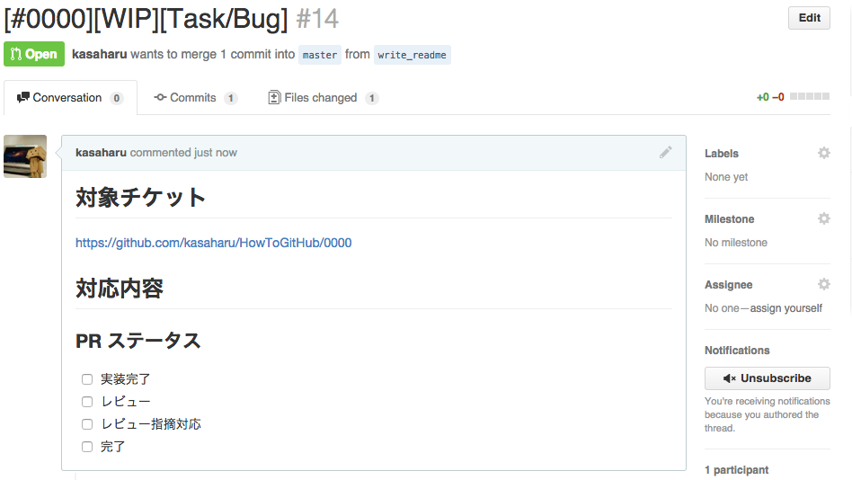

# pullreq
* コマンド一発で GitHub へ Pull Request を発行するためのツール
    * [create_pullrequest.sh](https://github.com/kasaharu/scriptForGitHub/blob/master/scripts/create_pullrequest.sh) を go で書き直し

# インストール方法(go が入っていること)

* 下記コマンドでインストール
    * `$ go get github.com/kasaharu/pullreq`

# 使い方

## テンプレートファイルの配置

#### コマンド

* Pull Request 発行時のテンプレートを設定する
    * `$ pullreq set`

## Pull Request の発行

#### 事前準備
* カレントディレクトリが git リポジトリであること
* Pull Request を発行する直前であること
    * commit や push が終わっていること

#### コマンド
* `$ pullreq 0000`(0000 は数字)
    * 0000 の部分には BTS などのチケット番号を指定する
* スクリプト実行後は下記のようなページが表示される

